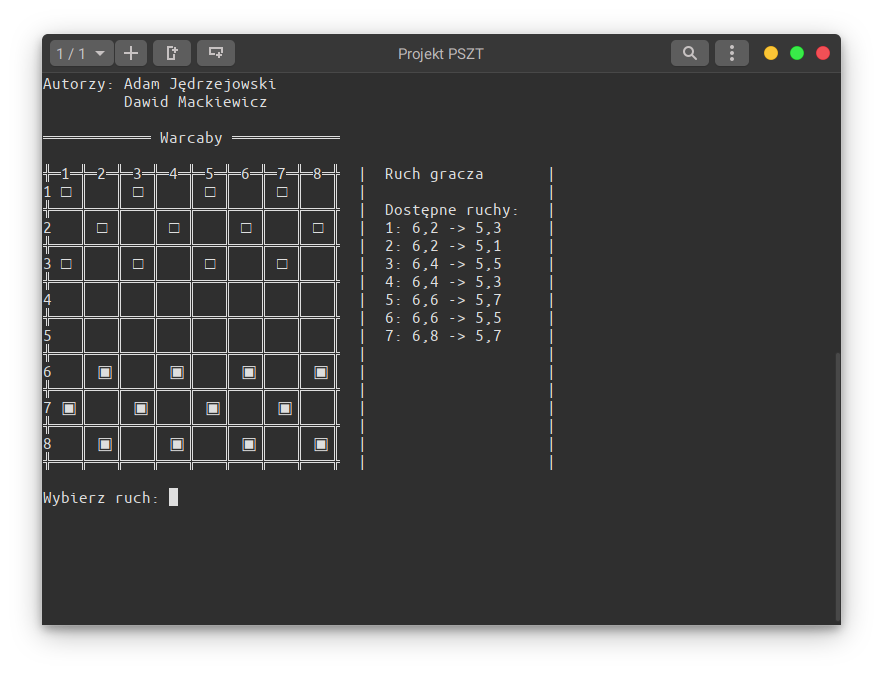
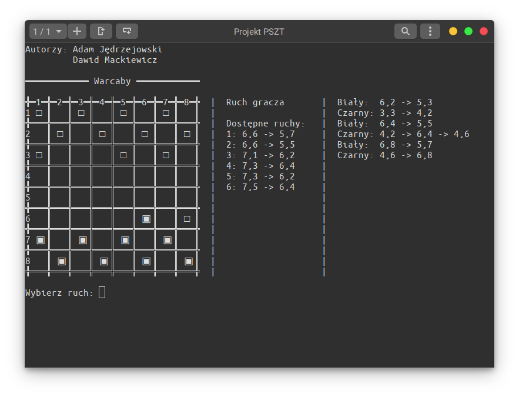

# Warcaby

Projekt powstał na przedmiot PSZT.





## Opis zadania

```
Warcaby w wariancie rosyjskim, może być interfejs konsolowy.
Gra z komputerem, przydatne algorytmy: minimax z przycinaniem alpha-beta.
Przed rozpoczęciem realizacji projektu proszę zapoznać się z zawartością strony.
```

Zasady gry wzięliśmy z tej [strony](https://www.kurnik.pl/warcabyrosyjskie/zasady.phtml).
Uznaliśmy możliwość bicia w przód jak i tył, ale ruch może być tylko w przód.
Każdy pion, który znajdzie się na przeciwnym końcu planszy awansuje na damkę.
Bicie jest obowiązkowe, ale wybór z wielu możliwości bić jest dowolny.
Nie ma dodatkowych zasad typu zasad określających remis, gdy zostanie dokonana pewna ilość ruchów damkami.

## Dokumentacja

Aby uruchomić projekt należy wpisać komendę `./src/main.py`.
Z uwagi na dość nietypowy sposób implementacji obsługi sygnałów w python'ie wyjść należy skrótem `Ctrl+Z`
Cały projekt został przetestowany na wersji `3.8`.
Jest dostępny w repozytorium na [Github'ie](https://github.com/dawidmyk/Warcaby).


### Opis programu z poziomu użytkownika

Użytkownik zaczyna gre jako biały na dole planszy.
Przyjęliśmy, że białe pinki to te wypełnione, natomiast czarne to puste, nie jest to trywialne, z uwagi, na możliwość występowania różnych stylów terminala.
Użytkownik może wybrać ruch z pośród N możliwych, wybór następuje przed podanie indeksu ruchu.
Przestrzeń terminala jest podzielona na trzy sekcje: plansza gry, możliwe ruchy i historia rozgrywki.
Punkty na planszy są oznaczane jako dwie liczby, numer wiersza(pion) i numer kolumny(poziom) oddzielone przecinkiem.
Po dokonaniu wyboru, który trzeba zatwierdzić enterem, następuje ruch komputera.
W celu lepszych doznań użytkownika, komputer myśli minimum 3 sekundy.
Następnie gracz z komputerem wykonują ruchy na przemiennie.

### Podział klas w programie

Postanowiliśmy rozdzielić zasady gry od algorytmu przeszukiwania.
Daje to nam swobodę w zmienianiu zasad gry, nie zmieniając algorytmu decyzyjnego.
Umożliwia to też zaimplementowanie dwóch graczy ludzkich, co było bardzo pomocne w pierwszych fazach projektu.

#### Stan gry i ruchy

Gra w warcaby opiera się na ruchach turowych, ale nie naprzemiennych.
Podzieliliśmy program na 3 klasy z danymi i 1 pomocniczą:
 - `CheckersState` w pliku `src/game/state.py`, reprezentującą stan planszy
 - `CheckerMove` w pliku `src/game/move.py`, reprezentującą ruch jednego pionka (jedno posunięcie)
 - `CheckerMoveComplex` w pliku `src/game/moveComlex.py`, reprezentującą ruch jednego pionka (wiele posunięć)
 - `CheckerType` w pliku `src/game/type.py`, do określania typów pionków i ich drużyn
 
Stan gry posiada planszę z pionkami, informacje o tym, który gracz ma teraz ruch oraz listę możliwych ruchów oraz kilka innych funkcji ułatwiających implementacje.
Stan można utworzyć z ruchu, jako stan kolejny oraz jako stan początkowy nie podając argumentów.
Stan jest wstanie się sam rozwijać jak o to go poprosimy.

Ruch, zawiera w sobie stan poprzedni i stan następny oraz informacje z kąd do kąd przestawiamy pionek.
Problemem w warcabach jest to, że ruch może być złożony, a mianowicie, jedne gracz może przestawić pionek kilka razy w jednym ruchu, co utrudnia implementacje.
Gdybyśmy uznali taki stan rzeczy to, implementacja ruchu była by trudna i mało edytowalna.
Dlatego rozwiązaliśmy ten problem, ruch to jedna przedstawienie pionka, a po ruchu gracza, może nastąpić ruch tego samego gracza.
Taka implementacja uniemożliwiała by implementacje algorytmu min-max, dlatego postanowiliśmy użyć wzorca projektowe: kompozyt.
Stany rozwijając się po jednym ruchu, ale ruchy złożone są pakowane w raz z stanami do obiektu ruchu złożonego.
Powstaje dualizm drzewa, który działa całkiem przyzwoicie.

Generowanie listy dostępnych kroków jest implementowane przez funkcje `CheckersState._generateAvailableMoves`, w niej są określane dozwolone ruchu gracza i to w niej są definiowane zasady poruszania się pionków na planszy. 
Analiza przejścia stanów znajduje się w `CheckersState._insertDataFromMove`, definiowane są tam bardziej złożone czynność gry takie jak rozwijanie złożonych ruchów. 

#### Algorytm min-max

Algorytm wyboru ruchów znajduje się w pliku `src/game/ai.py` w funkcji `ai_magic_stuff`.
Wybiera ona, który ruch wybrać w rozgrywce za pomocą algorytmu min-max.
Sam algorytm został zaimplementowany w funkcjach `move_min_max` i `min_max`.

### Wnioski

Python nie nadaje się do pisania algorytmów.
Zaimplementowane rozwiązanie jest strasznie wolne, wykonuje się około 3s na bardzo dobrym procesorze.
Sam algorytm jest dość prosty w implementacji. 

## Autorzy

Adam Jędrzejowski <adam@jedrzejowski.pl>
<br>
Implementacja stanów i zasad gry.

Dawid Mackiewicz <dawidmyk@wp.pl>
<br>
Implementacja algorytmów decyzyjnych.